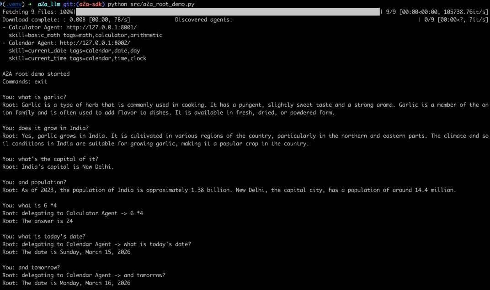

# A2A LLM Demo

This project is a small local demonstration of an A2A architecture using the official Python A2A SDK and three agents:

- a calculator agent
- a calendar agent
- a root agent that routes requests to the right remote agent or answers directly

The implementation is intentionally small. It uses the official Python A2A SDK for local HTTP servers, agent cards for discovery, and `message/send` for agent-to-agent communication.

## What Architecture This Uses

This demo uses a hub-and-spoke multi-agent pattern.

- The calculator agent is a specialized remote worker for arithmetic.
- The calendar agent is a specialized remote worker for date and time questions.
- The root agent is the entry point for the user. It decides whether to delegate to one or more remote agents, then combines their responses.

In practical terms:

- the user talks to the root agent
- the root agent discovers remote agents through their agent cards
- the root agent sends tasks over HTTP using JSON-RPC
- the specialized agents return their results
- the root agent prints the final response

This demo uses the official Python A2A SDK rather than a custom transport layer. The point is to show the mechanics clearly:

- agent discovery
- capability advertisement
- remote task delegation
- result aggregation

## Project Structure

The repository uses a `src` layout:

```text
.
├── pyproject.toml
├── README.md
└── src/
    ├── llm.py
    ├── a2a_calculator_server.py
    ├── a2a_calendar_server.py
    └── a2a_root_demo.py
```

Briefly:

- `src/llm.py`: shared LLM wrapper
- `src/a2a_calculator_server.py`: calculator agent server
- `src/a2a_calendar_server.py`: calendar agent server
- `src/a2a_root_demo.py`: root orchestrator and interactive demo loop

## How It Works

Each remote agent exposes official SDK-backed A2A endpoints:

- `GET /.well-known/agent-card.json`
- `POST /` with JSON-RPC `message/send`

The agent card advertises the agent’s identity and skills. The root agent uses the official A2A client to discover and call the remote agents.

Current ports:

- calculator agent: `http://127.0.0.1:8001`
- calendar agent: `http://127.0.0.1:8002`

## How To Run

Open three terminals from the repo root.

Install the project in editable mode once:

```bash
pip install -e .
```

Then you can run the demo in either of these ways.

Start the calculator agent:

```bash
PYTHONPATH=src python3 src/a2a_calculator_server.py
```

Start the calendar agent:

```bash
PYTHONPATH=src python3 src/a2a_calendar_server.py
```

Start the root demo:

```bash
PYTHONPATH=src python3 src/a2a_root_demo.py
```

Or use the installed console scripts:

```bash
a2a-calculator
a2a-calendar
a2a-root-demo
```

The server agents are implemented with the official A2A Python SDK primitives:

- `AgentExecutor`
- `DefaultRequestHandler`
- `InMemoryTaskStore`
- `A2AStarletteApplication`

The root demo uses the official client side SDK through `ClientFactory.connect(...)`.

## Example Demo Queries

Try:

- `23*19`
- `what time is it?`
- `what date is today?`
- `what date is tomorrow?`
- `what day is next Friday?`
- `what is today's date and what is 23*19?`
- `explain what this demo is doing`

The last kind of query shows the root agent answering directly without delegating.

## Example Demo Output



## Inspect Agent Cards

You can inspect the advertised capabilities directly:

```bash
curl http://127.0.0.1:8001/.well-known/agent-card.json
curl http://127.0.0.1:8002/.well-known/agent-card.json
```

## Example JSON-RPC Request

You can call an agent directly without the root orchestrator:

```bash
curl -X POST http://127.0.0.1:8001 \
  -H 'Content-Type: application/json' \
  -d '{
    "jsonrpc": "2.0",
    "id": "demo-1",
    "method": "message/send",
    "params": {
      "message": {
        "kind": "message",
        "messageId": "msg-1",
        "role": "user",
        "parts": [
          { "kind": "text", "text": "23*19" }
        ]
      }
    }
  }'
```

## Notes

- The calculator and calendar agents are exposed as independent remote services.
- The root agent uses the shared LLM to choose whether to answer directly or delegate to one or more remote agents.
- The calendar agent uses the shared LLM to interpret date/time questions, with a small deterministic fallback for common cases.
- This demo is meant for experimentation and explanation, not for hardened production use.
